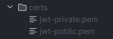

# TMS

API для управления задачами

## Stack
- python 3.13
- sqlalchemy 2.0.41 (postgresql)
- fastapi 0.115.12
- alembic 1.16.1

## Project launch:
1. Создать виртуальное окружение.
2. Установить зависимости: 
    > uv sync
3. Создать ".env" файл на примере ".env_example".
4. Создать директорию /certs с файлами сертификата 'jwt-public.pem', 'jwt-private.pem'
    
    
5. Создать БД
6. Накатить миграции
   > alembic upgrade head
7. Запустить src.main:app
    > uvicorn --port 8000 --host 127.0.0.1 src.main:app --reload